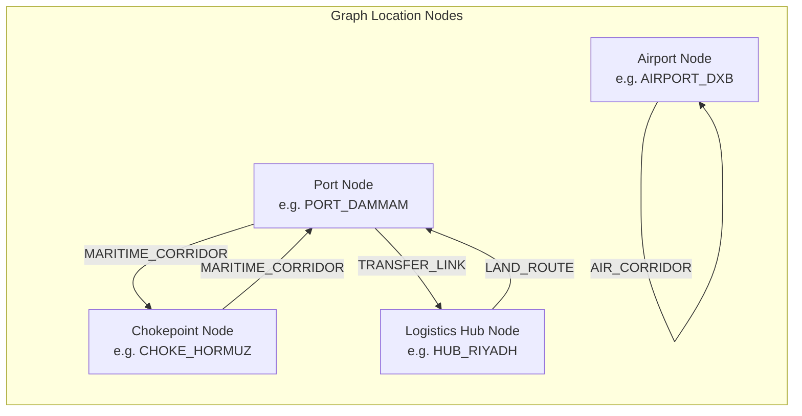

# 🗄️ L.I.N.K. Database & Graph Schema (Neo4j)

This directory contains the graph database definition, Cypher seed queries, and topology structures that form the foundation of the **L.I.N.K. Middle East Supply Chain Digital Twin**.

---

## 🌐 Graph Topology Model

The logistics network is modeled as a property graph in **Neo4j**, capturing nodes (aerodromes, seaports, dry hubs, and maritime chokepoints) and directed relationships (corridors).



---

## 🏷️ Node Classes & Definitions

| Label | Primary Attributes | Examples |
| :--- | :--- | :--- |
| **`:Port`** | `id`, `name`, `name_ar`, `lat`, `lon`, `country`, `capacity_teu`, `status` | `PORT_JEBEL_ALI`, `PORT_SALALAH`, `PORT_DAMMAM`, `PORT_JEDDAH`, `PORT_MERSIN` |
| **`:Airport`** | `id`, `name`, `name_ar`, `lat`, `lon`, `country`, `iata`, `safe_haven`, `status` | `AIRPORT_DXB`, `AIRPORT_RUH`, `AIRPORT_AMM` (Safe Haven), `AIRPORT_BGW` (Safe Haven), `AIRPORT_IST` |
| **`:LogisticsHub`** | `id`, `name`, `name_ar`, `lat`, `lon`, `country`, `type`, `status` | `HUB_RIYADH`, `HUB_GAZIANTEP`, `HUB_ZAKHO` |
| **`:Chokepoint`** | `id`, `name`, `name_ar`, `lat`, `lon`, `country`, `type`, `status` | `CHOKE_HORMUZ`, `CHOKE_BAB_EL_MANDEB`, `CHOKE_SUEZ` |

---

## 🔗 Relationship Types & Edge Properties

All corridors between locations carry rich operational and economic telemetry:

| Relationship | Description | Edge Attributes |
| :--- | :--- | :--- |
| **`:MARITIME_CORRIDOR`** | Open ocean and coastal shipping lanes | `distance_km`, `transit_time_hours`, `cost_usd`, `mode: "MARITIME"`, `status: "OPEN"\|"CLOSED"`, `risk_penalty` |
| **`:AIR_CORRIDOR`** | Geodesic civil and cargo flight paths | `distance_km`, `transit_time_hours`, `cost_usd`, `mode: "AIR"`, `status: "OPEN"\|"CLOSED"`, `risk_penalty` |
| **`:LAND_ROUTE`** | Highway, expressway, and freight rail tracks | `distance_km`, `transit_time_hours`, `cost_usd`, `mode: "LAND"`, `status: "OPEN"\|"CLOSED"`, `risk_penalty` |
| **`:TRANSFER_LINK`** | Inter-modal dry port transfers (port-to-rail/truck) | `distance_km`, `transit_time_hours`, `cost_usd`, `mode: "TRANSFER"`, `transfer_penalty` |

---

## ⚡ Seeding the Database

### Option A: Via Neo4j AuraDB (Cloud)
1. Log into your [Neo4j AuraDB Console](https://console.neo4j.io/).
2. Open **Query** workspace for your instance.
3. Paste the contents of [`schema_and_seed.cypher`](schema_and_seed.cypher) and execute.

### Option B: Via Cypher Shell (CLI)
```bash
cypher-shell -u neo4j -p "your_password" -a "neo4j+s://your-instance.databases.neo4j.io" -f schema_and_seed.cypher
```

### Option C: Zero-Config In-Memory Fallback
If no live Neo4j instance is configured in `backend/.env`, the system automatically activates its built-in in-memory digital twin (`backend/db/neo4j_client.py`), preserving 100% of the nodes, corridors, and routing algorithms without external dependencies.
